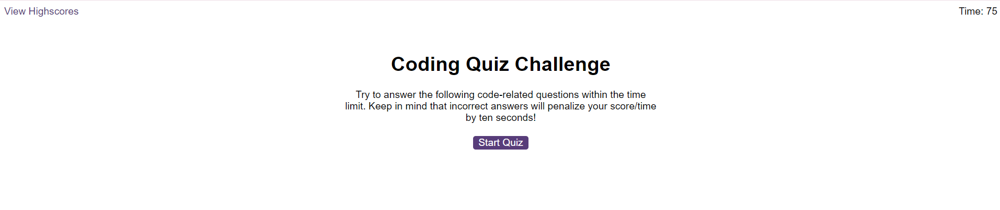
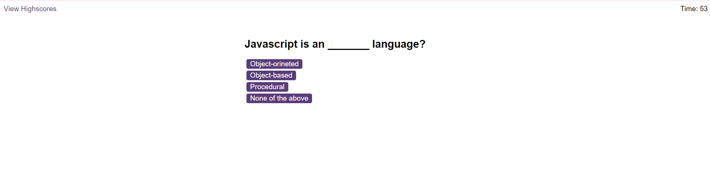
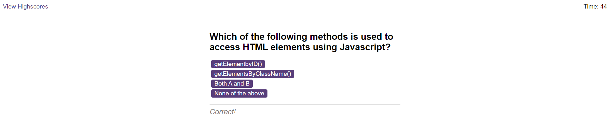
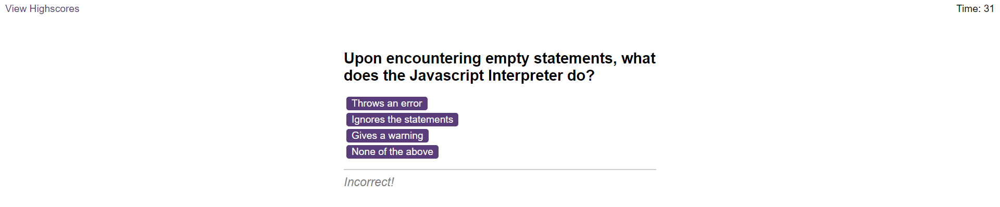
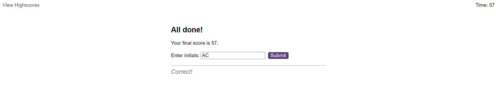
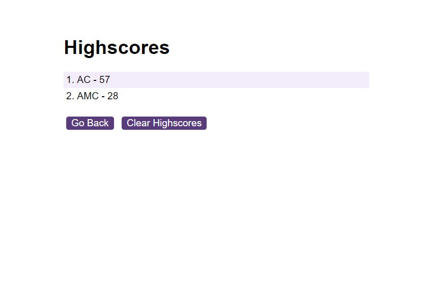

# Javascript-Quiz

## A program that allows the user to go trrough a javascrip coding quiz

This project was carried out to create an app that allows the user to go trrough a timed javascrip coding quiz and let's them save their initials as a way to record their highscores.

## Installation

To use this webpage, the user must have access to the internet. Enter, in the search bar, the address "https://antimio.github.io/Javascript-Quiz/" and press Enter.

## Usage

To use the webpage:

1 - Navigate to it and note the elements on the page. The quiz works by penalizing wrong answers through the subtraction of 10 seconds from the timer. The user loses if the timer reaches zero.

2 - Click the button and start the quiz.

3 - Note that the timer is going down. If the answer is correct, a meesage of correct will appear on the screen, as well as a sound.

4 - If an incorrect answer is given, then the message and sound are different.

5 - When the questions are all answered, the user's score will be shown to them. Their score is the time left on the timer. The user will have the opportunity to assciate their itinial to that score, which will be saved on a leaderboard.

6 - Once the user clicks submit, the score is saved in the "Highscores" page.

## Credits

The EdEx Web Development bootcamp team provided the HTML code, the css code and the sound files. Visit their website at https://skillsforlife.edx.org/enroll/ui/signIn

The questions for this quiz were taken from the InterviewBit website: https://www.interviewbit.com/.

## License

MIT License

Copyright (c) [2023] [Antimio Luale Da Silva Monteiro Casimiro]

Permission is hereby granted, free of charge, to any person obtaining a copy
of this software and associated documentation files (the "Software"), to deal
in the Software without restriction, including without limitation the rights
to use, copy, modify, merge, publish, distribute, sublicense, and/or sell
copies of the Software, and to permit persons to whom the Software is
furnished to do so, subject to the following conditions:

The above copyright notice and this permission notice shall be included in all
copies or substantial portions of the Software.

THE SOFTWARE IS PROVIDED "AS IS", WITHOUT WARRANTY OF ANY KIND, EXPRESS OR
IMPLIED, INCLUDING BUT NOT LIMITED TO THE WARRANTIES OF MERCHANTABILITY,
FITNESS FOR A PARTICULAR PURPOSE AND NONINFRINGEMENT. IN NO EVENT SHALL THE
AUTHORS OR COPYRIGHT HOLDERS BE LIABLE FOR ANY CLAIM, DAMAGES OR OTHER
LIABILITY, WHETHER IN AN ACTION OF CONTRACT, TORT OR OTHERWISE, ARISING FROM,
OUT OF OR IN CONNECTION WITH THE SOFTWARE OR THE USE OR OTHER DEALINGS IN THE
SOFTWARE.